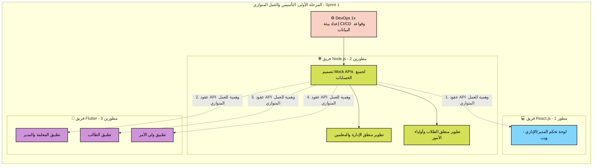
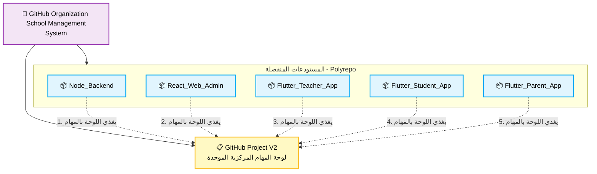
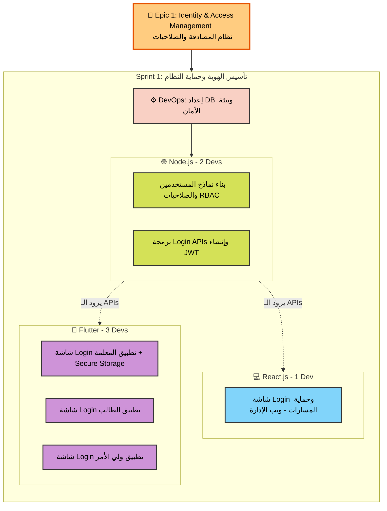
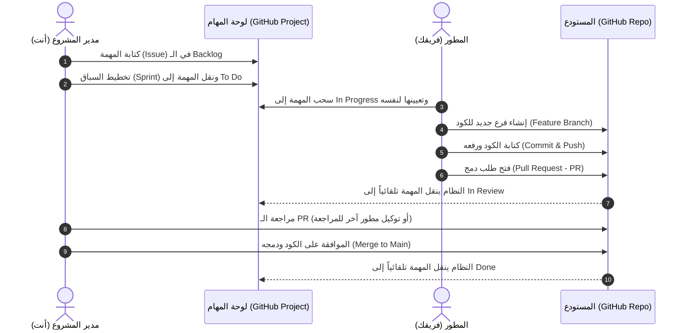

```mermaid

flowchart TD
    classDef devops fill:#f9d0c4,stroke:#333,stroke-width:2px,color:#000;
    classDef backend fill:#d4e157,stroke:#333,stroke-width:2px,color:#000;
    classDef frontend fill:#81d4fa,stroke:#333,stroke-width:2px,color:#000;
    classDef mobile fill:#ce93d8,stroke:#333,stroke-width:2px,color:#000;

    subgraph Phase1 [المرحلة الأولى: التأسيس والعمل المتوازي - Sprint 1]
        direction TB
        
        A[⚙️ DevOps 1x <br> إعداد بيئة CI/CD وقواعد البيانات]:::devops
        
        subgraph Backend_Team [🌐 فريق Node.js - 2 مطورين]
            B1[تصميم Mock APIs لجميع الحسابات]:::backend
            B2[تطوير منطق الإدارة والمعلمين]:::backend
            B3[تطوير منطق الطلاب وأولياء الأمور]:::backend
            B1 --> B2 & B3
        end

        A --> B1

        subgraph Frontend_Web [💻 فريق React.js - 1 مطور]
            C1[لوحة تحكم المدير/الإداري - ويب]:::frontend
        end

        subgraph Mobile_Team [📱 فريق Flutter - 3 مطورين]
            D1[تطبيق المعلمة والمدير]:::mobile
            D2[تطبيق الطالب]:::mobile
            D3[تطبيق ولي الأمر]:::mobile
        end

        B1 -.->|1. عقود API وهمية للعمل المتوازي| C1
        B1 -.->|2. عقود API وهمية للعمل المتوازي| D1
        B1 -.->|3. عقود API وهمية للعمل المتوازي| D2
        B1 -.->|4. عقود API وهمية للعمل المتوازي| D3
    end
```

```mermaid
flowchart TD
    classDef org fill:#f3e5f5,stroke:#8e24aa,stroke-width:2px,color:#000;
    classDef board fill:#fff9c4,stroke:#fbc02d,stroke-width:2px,color:#000;
    classDef repo fill:#e1f5fe,stroke:#03a9f4,stroke-width:2px,color:#000;

    Org[🏢 GitHub Organization <br> School Management System]:::org
    Board[📋 GitHub Project V2 <br> لوحة المهام المركزية الموحدة]:::board

    Org --> Board

    subgraph Repositories [المستودعات المنفصلة - Polyrepo]
        direction LR
        R1[📦 Node_Backend]:::repo
        R2[📦 React_Web_Admin]:::repo
        R3[📦 Flutter_Teacher_App]:::repo
        R4[📦 Flutter_Student_App]:::repo
        R5[📦 Flutter_Parent_App]:::repo
    end

    Org --> Repositories
    
    R1 -.->|1. يغذي اللوحة بالمهام| Board
    R2 -.->|2. يغذي اللوحة بالمهام| Board
    R3 -.->|3. يغذي اللوحة بالمهام| Board
    R4 -.->|4. يغذي اللوحة بالمهام| Board
    R5 -.->|5. يغذي اللوحة بالمهام| Board
```

```mermaid
flowchart TD
    classDef devops fill:#f9d0c4,stroke:#333,stroke-width:2px,color:#000;
    classDef backend fill:#d4e157,stroke:#333,stroke-width:2px,color:#000;
    classDef frontend fill:#81d4fa,stroke:#333,stroke-width:2px,color:#000;
    classDef mobile fill:#ce93d8,stroke:#333,stroke-width:2px,color:#000;
    classDef epic fill:#ffcc80,stroke:#e65100,stroke-width:3px,color:#000;

    Epic1[🔐 Epic 1: Identity & Access Management <br> نظام المصادقة والصلاحيات]:::epic

    subgraph Sprint1 [Sprint 1: تأسيس الهوية وحماية النظام]
        direction TB
        
        A[⚙️ DevOps: إعداد DB وبيئة الأمان]:::devops
        
        subgraph Backend_Team [🌐 Node.js - 2 Devs]
            B1[بناء نماذج المستخدمين والصلاحيات RBAC]:::backend
            B2[برمجة Login APIs وإنشاء JWT]:::backend
        end

        subgraph Frontend_Web [💻 React.js - 1 Dev]
            C1[شاشة Login وحماية المسارات - ويب الإدارة]:::frontend
        end

        subgraph Mobile_Team [📱 Flutter - 3 Devs]
            D1[شاشة Login تطبيق المعلمة + Secure Storage]:::mobile
            D2[شاشة Login تطبيق الطالب]:::mobile
            D3[شاشة Login تطبيق ولي الأمر]:::mobile
        end

        A --> Backend_Team
        Backend_Team -.->|يزود الـ APIs| Frontend_Web
        Backend_Team -.->|يزود الـ APIs| Mobile_Team
    end
    
    Epic1 --> Sprint1
```

```mermaid
sequenceDiagram
    autonumber
    actor PM as مدير المشروع (أنت)
    participant Board as لوحة المهام (GitHub Project)
    actor Dev as المطور (فريقك)
    participant Repo as المستودع (GitHub Repo)
    
    PM->>Board: كتابة المهمة (Issue) في الـ Backlog
    PM->>Board: تخطيط السباق (Sprint) ونقل المهمة إلى To Do
    Dev->>Board: سحب المهمة إلى In Progress وتعيينها لنفسه
    Dev->>Repo: إنشاء فرع جديد للكود (Feature Branch)
    Dev->>Repo: كتابة الكود ورفعه (Commit & Push)
    Dev->>Repo: فتح طلب دمج (Pull Request - PR)
    Repo-->>Board: النظام ينقل المهمة تلقائياً إلى In Review
    PM->>Repo: مراجعة الـ PR (أو توكيل مطور آخر للمراجعة)
    PM->>Repo: الموافقة على الكود ودمجه (Merge to Main)
    Repo-->>Board: النظام ينقل المهمة تلقائياً إلى Done
```
ذ
