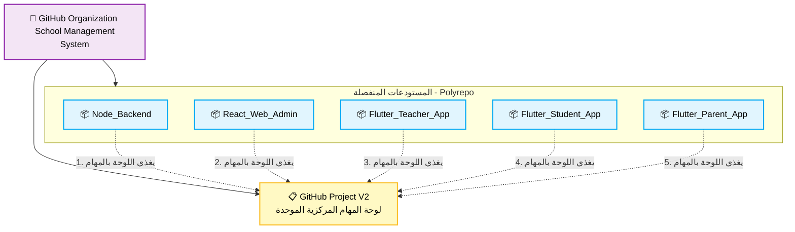

```mermaid
flowchart TD
    classDef org fill:#f3e5f5,stroke:#8e24aa,stroke-width:2px,color:#000;
    classDef board fill:#fff9c4,stroke:#fbc02d,stroke-width:2px,color:#000;
    classDef repo fill:#e1f5fe,stroke:#03a9f4,stroke-width:2px,color:#000;

    Org[🏢 GitHub Organization <br> School Management System]:::org
    Board[📋 GitHub Project V2 <br> لوحة المهام المركزية الموحدة]:::board

    Org --> Board

    subgraph Repositories [المستودعات المنفصلة - Polyrepo]
        direction LR
        R1[📦 Node_Backend]:::repo
        R2[📦 React_Web_Admin]:::repo
        R3[📦 Flutter_Teacher_App]:::repo
        R4[📦 Flutter_Student_App]:::repo
        R5[📦 Flutter_Parent_App]:::repo
    end

    Org --> Repositories
    
    R1 -.->|1. يغذي اللوحة بالمهام| Board
    R2 -.->|2. يغذي اللوحة بالمهام| Board
    R3 -.->|3. يغذي اللوحة بالمهام| Board
    R4 -.->|4. يغذي اللوحة بالمهام| Board
    R5 -.->|5. يغذي اللوحة بالمهام| Board
```
