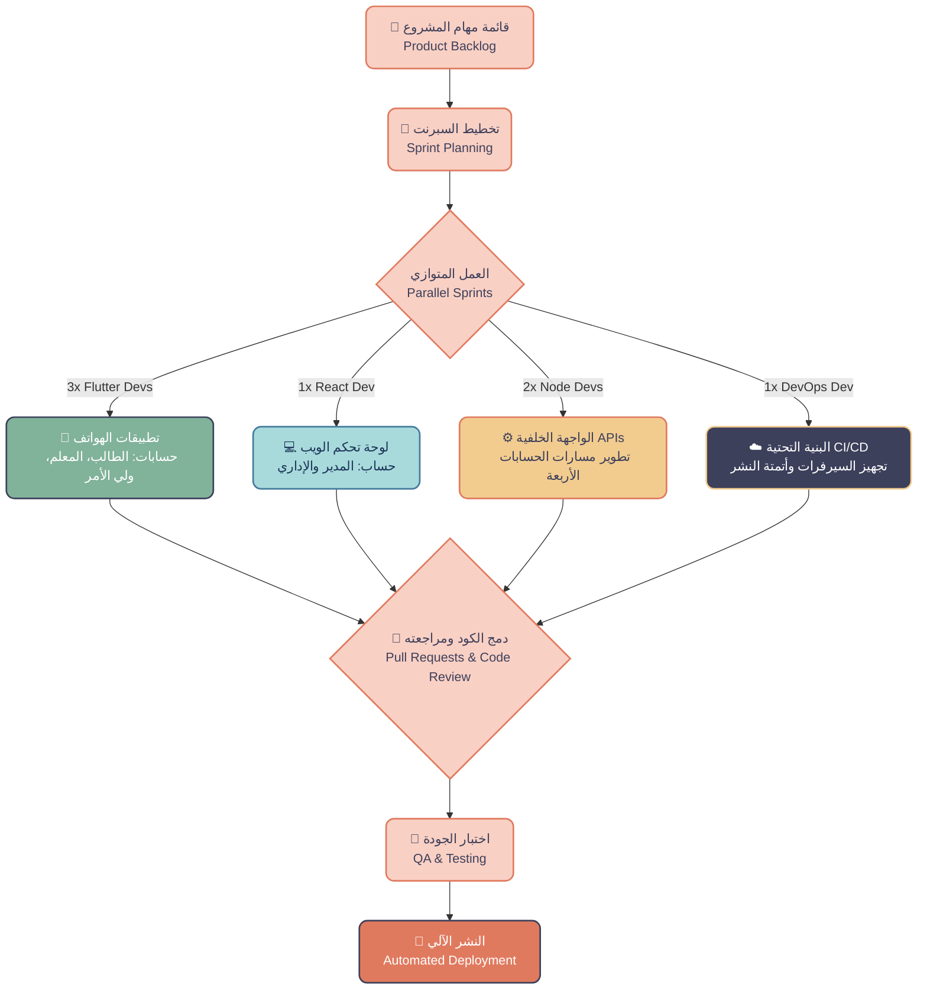

```mermaid
flowchart TD
    %% تعريف الألوان والتنسيقات
    classDef planning fill:#f9d0c4,stroke:#e07a5f,stroke-width:2px,color:#3d405b,rx:10px,ry:10px;
    classDef flutter fill:#81b29a,stroke:#3d405b,stroke-width:2px,color:#fff,rx:10px,ry:10px;
    classDef nodejs fill:#f2cc8f,stroke:#e07a5f,stroke-width:2px,color:#3d405b,rx:10px,ry:10px;
    classDef react fill:#a8dadc,stroke:#457b9d,stroke-width:2px,color:#1d3557,rx:10px,ry:10px;
    classDef devops fill:#3d405b,stroke:#f2cc8f,stroke-width:2px,color:#fff,rx:10px,ry:10px;
    classDef goal fill:#e07a5f,stroke:#3d405b,stroke-width:2px,color:#fff,rx:10px,ry:10px;

    A[🎯 قائمة مهام المشروع<br>Product Backlog]:::planning --> B(📝 تخطيط السبرنت<br>Sprint Planning):::planning

    B --> C{العمل المتوازي<br>Parallel Sprints}:::planning

    C -->|3x Flutter Devs| D[📱 تطبيقات الهواتف<br>حسابات: الطالب، المعلم، ولي الأمر]:::flutter
    C -->|1x React Dev| E[💻 لوحة تحكم الويب<br>حساب: المدير والإداري]:::react
    C -->|2x Node Devs| F[⚙️ الواجهة الخلفية APIs<br>تطوير مسارات الحسابات الأربعة]:::nodejs
    C -->|1x DevOps Dev| G[☁️ البنية التحتية CI/CD<br>تجهيز السيرفرات وأتمتة النشر]:::devops

    D --> H{🤝 دمج الكود ومراجعته<br>Pull Requests & Code Review}:::planning
    E --> H
    F --> H
    G --> H

    H --> I[🧪 اختبار الجودة<br>QA & Testing]:::planning
    I --> J[🚀 النشر الآلي<br>Automated Deployment]:::goal
```
