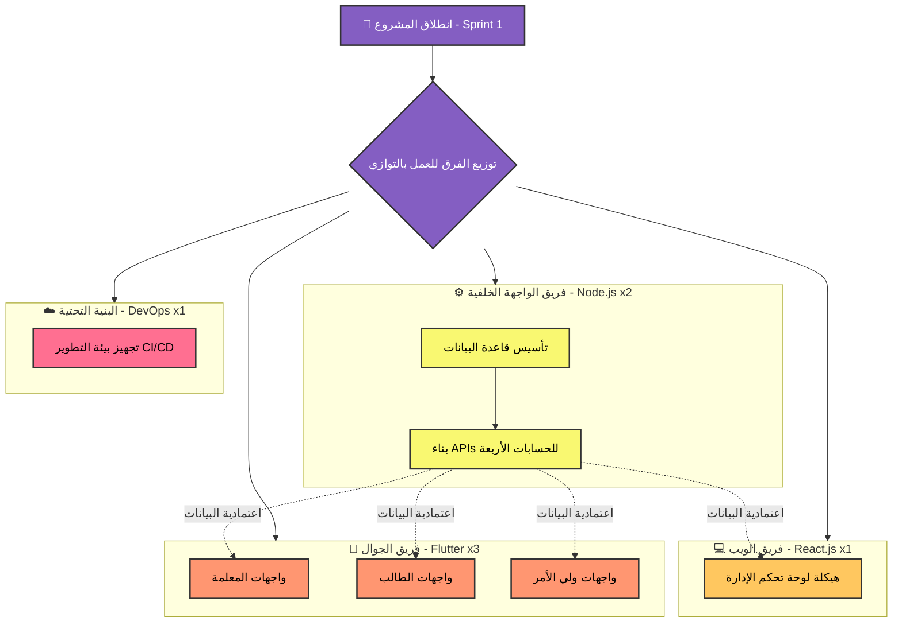

```mermaid
flowchart TD
    classDef backend fill:#f9f871,stroke:#333,stroke-width:2px,color:#000;
    classDef frontend fill:#ffc75f,stroke:#333,stroke-width:2px,color:#000;
    classDef mobile fill:#ff9671,stroke:#333,stroke-width:2px,color:#000;
    classDef devops fill:#ff6f91,stroke:#333,stroke-width:2px,color:#000;
    classDef main fill:#845ec2,stroke:#333,stroke-width:2px,color:#fff;

    A[🚀 انطلاق المشروع - Sprint 1]:::main --> B{توزيع الفرق للعمل بالتوازي}:::main

    subgraph Backend [⚙️ فريق الواجهة الخلفية - Node.js x2]
        N1[تأسيس قاعدة البيانات]:::backend
        N2[بناء APIs للحسابات الأربعة]:::backend
        N1 --> N2
    end

    subgraph Web [💻 فريق الويب - React.js x1]
        R1[هيكلة لوحة تحكم الإدارة]:::frontend
    end

    subgraph Mobile [📱 فريق الجوال - Flutter x3]
        F1[واجهات المعلمة]:::mobile
        F2[واجهات الطالب]:::mobile
        F3[واجهات ولي الأمر]:::mobile
    end

    subgraph DevOps [☁️ البنية التحتية - DevOps x1]
        D1[تجهيز بيئة التطوير CI/CD]:::devops
    end

    B --> Backend
    B --> Web
    B --> Mobile
    B --> DevOps

    N2 -.->|اعتمادية البيانات| R1
    N2 -.->|اعتمادية البيانات| F1
    N2 -.->|اعتمادية البيانات| F2
    N2 -.->|اعتمادية البيانات| F3
```
