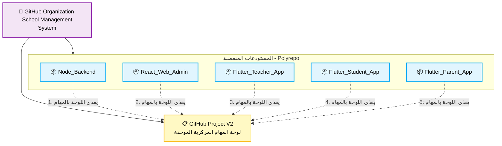
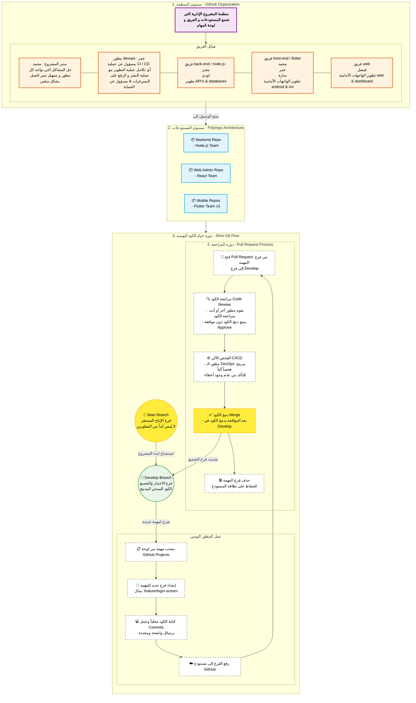
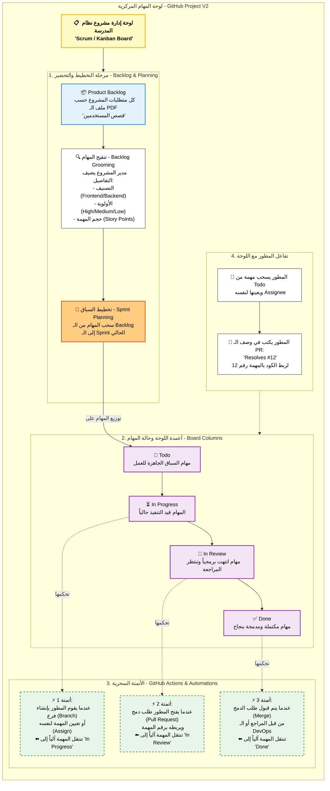

```mermaid
flowchart TD
    classDef org fill:#f3e5f5,stroke:#8e24aa,stroke-width:2px,color:#000;
    classDef board fill:#fff9c4,stroke:#fbc02d,stroke-width:2px,color:#000;
    classDef repo fill:#e1f5fe,stroke:#03a9f4,stroke-width:2px,color:#000;

    Org[🏢 GitHub Organization <br> School Management System]:::org
    Board[📋 GitHub Project V2 <br> لوحة المهام المركزية الموحدة]:::board

    Org --> Board

    subgraph Repositories [المستودعات المنفصلة - Polyrepo]
        direction LR
        R1[📦 Node_Backend]:::repo
        R2[📦 React_Web_Admin]:::repo
        R3[📦 Flutter_Teacher_App]:::repo
        R4[📦 Flutter_Student_App]:::repo
        R5[📦 Flutter_Parent_App]:::repo
    end

    Org --> Repositories
    
    R1 -.->|1. يغذي اللوحة بالمهام| Board
    R2 -.->|2. يغذي اللوحة بالمهام| Board
    R3 -.->|3. يغذي اللوحة بالمهام| Board
    R4 -.->|4. يغذي اللوحة بالمهام| Board
    R5 -.->|5. يغذي اللوحة بالمهام| Board
```

```mermaid
flowchart TD
    classDef org fill:#f3e5f5,stroke:#8e24aa,stroke-width:3px,color:#000,font-weight:bold;
    classDef roles fill:#fff3e0,stroke:#e65100,stroke-width:2px,color:#000;
    classDef repos fill:#e1f5fe,stroke:#03a9f4,stroke-width:2px,color:#000;
    classDef gitflow fill:#e8f5e9,stroke:#43a047,stroke-width:2px,color:#000;
    classDef action fill:#fff,stroke:#333,stroke-width:1px,color:#000,stroke-dasharray: 5 5;
    classDef highlight fill:#ffeb3b,stroke:#fbc02d,stroke-width:2px,color:#000;

    subgraph OrgLevel [1. مستوى المنظمة - GitHub Organization]
        direction TB
        Org["منظمة المشروع الإدارية التي تجمع المستودعات و الفريق و لوحة المهام"]:::org
        
        subgraph RolesAccess [هيكل الفريق]
            direction LR
            PM["مدير المشروع : محمد\nحل المشاكل التي تواجه كل مطور و تسهيل سير العمل بشكل سلس"]:::roles
            DevOps["مطور devops : عمر\nمسؤول عن عملية CI / CD أي تكامل عملية التطوير مع عملية النشر و الرفع على السيرفرات & مسؤول عن الحماية"]:::roles
            Backend["فريق back-end / node.js :\nمعتز\nلودي\nتطوير API's & databases"]:::roles
            Flutter["فريق front-end / flutter\nمحمد\nعمر\nسارة\nتطوير الواجهات الأمامية android & ios"]:::roles
            Web["فريق web\nفيصل\nتطوير الواجهات الأمامية web & dashboard"]:::roles
            
            PM --- DevOps --- Backend --- Flutter --- Web
        end
        Org --> RolesAccess
    end

    subgraph ReposLevel [2. مستوى المستودعات - Polyrepo Architecture]
        direction LR
        R1[📦 Backend Repo\n- Node.js Team]:::repos
        R2[📦 Web Admin Repo\n- React Team]:::repos
        R3[📦 Mobile Repos\n- Flutter Team x3]:::repos
    end
    
    RolesAccess -->|يمنح الوصول إلى| ReposLevel

    subgraph GitWorkflow [3. دورة حياة الكود اليومية - Strict Git Flow]
        direction TB
        
        MainBranch((🌳 Main Branch\n فرع الإنتاج المستقر\n لا يُمس أبداً من المطورين)):::highlight
        DevBranch((🌿 Develop Branch\n فرع الاختبار والتجميع\n الكود المبدئي المدمج)):::gitflow
        
        MainBranch -->|استنساخ لبدء المشروع| DevBranch
        
        subgraph DeveloperDaily [عمل المطور اليومي]
            direction TB
            Task[📋 سحب مهمة من لوحة GitHub Projects]:::action
            CreateBranch[🔀 إنشاء فرع جديد للمهمة\n مثال: feature/login-screen]:::action
            Code[💻 كتابة الكود محلياً وعمل Commits\n برسائل واضحة ومحددة]:::action
            Push[☁️ رفع الفرع إلى مستودع GitHub]:::action
            
            Task --> CreateBranch --> Code --> Push
        end
        
        DevBranch -->|تفرع لمهمة جديدة| Task
        
        subgraph PullRequestCycle [4. دورة المراجعة - Pull Request Process]
            direction TB
            OpenPR[📝 فتح Pull Request من فرع المهمة\n إلى فرع Develop]:::action
            Review[🔍 مراجعة الكود Code Review\n- يقوم مطور آخر أو أنت بمراجعة الكود\n- يمنع دمج الكود دون موافقة Approve]:::action
            CI[⚙️ الفحص الآلي CI/CD\n- مطور الـ DevOps يبرمج فحصاً آلياً\n للتأكد من عدم وجود أخطاء]:::action
            Merge[✅ دمج الكود Merge\n- بعد الموافقة يدمج الكود في Develop]:::highlight
            DeleteBranch[🗑️ حذف فرع المهمة\n للحفاظ على نظافة المستودع]:::action
            
            OpenPR --> Review --> CI --> Merge --> DeleteBranch
        end
        
        Push --> OpenPR
        Merge -->|تحديث فرع التجميع| DevBranch
    end
    
    ReposLevel --> GitWorkflow
```

```mermaid
flowchart TD
    classDef board fill:#fff9c4,stroke:#fbc02d,stroke-width:3px,color:#000,font-weight:bold;
    classDef backlog fill:#e3f2fd,stroke:#1e88e5,stroke-width:2px,color:#000;
    classDef columns fill:#f3e5f5,stroke:#8e24aa,stroke-width:2px,color:#000;
    classDef auto fill:#e8f5e9,stroke:#43a047,stroke-width:2px,color:#000,stroke-dasharray: 5 5;
    classDef action fill:#fff,stroke:#333,stroke-width:1px,color:#000;
    classDef highlight fill:#ffcc80,stroke:#e65100,stroke-width:2px,color:#000;

    subgraph GitHubProject [لوحة المهام المركزية - GitHub Project V2]
        direction TB
        
        BoardTitle["📋 لوحة إدارة مشروع نظام المدرسة\n 'Scrum / Kanban Board'"]:::board
        
        subgraph BacklogPhase [1. مرحلة التخطيط والتحضير - Backlog & Planning]
            direction LR
            PB["📦 Product Backlog\n كل متطلبات المشروع حسب ملف الـ PDF\n 'قصص المستخدمين'"]:::backlog
            Grooming["🔍 تنقيح المهام - Backlog Grooming\n مدير المشروع يضيف التفاصيل:\n - التصنيف (Frontend/Backend)\n - الأولوية (High/Medium/Low)\n - حجم المهمة (Story Points)"]:::action
            SprintPlan["🎯 تخطيط السباق - Sprint Planning\n سحب المهام من الـ Backlog إلى الـ Sprint الحالي"]:::highlight
            
            PB --> Grooming --> SprintPlan
        end
        
        BoardTitle --> BacklogPhase

        subgraph KanbanColumns [2. أعمدة اللوحة وحالة المهام - Board Columns]
            direction LR
            Todo["📝 Todo\n مهام السباق الجاهزة للعمل"]:::columns
            InProgress["⏳ In Progress\n المهام قيد التنفيذ حالياً"]:::columns
            InReview["👀 In Review\n مهام انتهت برمجياً وتنتظر المراجعة"]:::columns
            Done["✅ Done\n مهام مكتملة ومدمجة بنجاح"]:::columns
            
            Todo --> InProgress --> InReview --> Done
        end
        
        SprintPlan -->|توزيع المهام على| Todo

        subgraph AutomationRules [3. الأتمتة السحرية - GitHub Actions & Automations]
            direction TB
            Auto1["⚡ أتمتة 1:\n عندما يقوم المطور بإنشاء فرع (Branch)\n أو تعيين المهمة لنفسه (Assign)\n ⬅️ تنتقل المهمة آلياً إلى 'In Progress'"]:::auto
            Auto2["⚡ أتمتة 2:\n عندما يفتح المطور طلب دمج (Pull Request)\n ويربطه برقم المهمة\n ⬅️ تنتقل المهمة آلياً إلى 'In Review'"]:::auto
            Auto3["⚡ أتمتة 3:\n عندما يتم قبول طلب الدمج (Merge)\n من قبل المراجع أو الـ DevOps\n ⬅️ تنتقل المهمة آلياً إلى 'Done'"]:::auto
        end

        InProgress -.->|تحكمها| Auto1
        InReview -.->|تحكمها| Auto2
        Done -.->|تحكمها| Auto3
        
        subgraph DeveloperInteraction [4. تفاعل المطور مع اللوحة]
            direction TB
            DevAction1["👤 المطور يسحب مهمة من Todo\n ويعينها لنفسه Assignee"]:::action
            DevAction2["🔗 المطور يكتب في وصف الـ PR:\n 'Resolves #12'\n لربط الكود بالمهمة رقم 12"]:::action
            
            DevAction1 --> DevAction2
        end
        
        DeveloperInteraction -.-> KanbanColumns
    end
```
