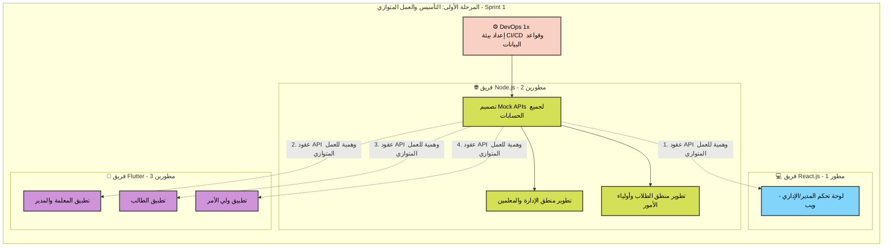
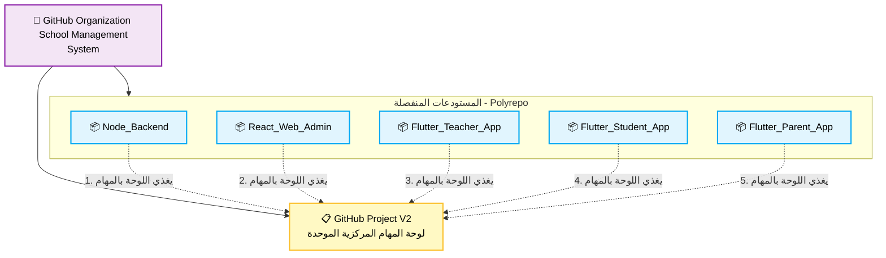

```mermaid

flowchart TD
    classDef devops fill:#f9d0c4,stroke:#333,stroke-width:2px,color:#000;
    classDef backend fill:#d4e157,stroke:#333,stroke-width:2px,color:#000;
    classDef frontend fill:#81d4fa,stroke:#333,stroke-width:2px,color:#000;
    classDef mobile fill:#ce93d8,stroke:#333,stroke-width:2px,color:#000;

    subgraph Phase1 [المرحلة الأولى: التأسيس والعمل المتوازي - Sprint 1]
        direction TB
        
        A[⚙️ DevOps 1x <br> إعداد بيئة CI/CD وقواعد البيانات]:::devops
        
        subgraph Backend_Team [🌐 فريق Node.js - 2 مطورين]
            B1[تصميم Mock APIs لجميع الحسابات]:::backend
            B2[تطوير منطق الإدارة والمعلمين]:::backend
            B3[تطوير منطق الطلاب وأولياء الأمور]:::backend
            B1 --> B2 & B3
        end

        A --> B1

        subgraph Frontend_Web [💻 فريق React.js - 1 مطور]
            C1[لوحة تحكم المدير/الإداري - ويب]:::frontend
        end

        subgraph Mobile_Team [📱 فريق Flutter - 3 مطورين]
            D1[تطبيق المعلمة والمدير]:::mobile
            D2[تطبيق الطالب]:::mobile
            D3[تطبيق ولي الأمر]:::mobile
        end

        B1 -.->|1. عقود API وهمية للعمل المتوازي| C1
        B1 -.->|2. عقود API وهمية للعمل المتوازي| D1
        B1 -.->|3. عقود API وهمية للعمل المتوازي| D2
        B1 -.->|4. عقود API وهمية للعمل المتوازي| D3
    end
```

```mermaid
flowchart TD
    classDef org fill:#f3e5f5,stroke:#8e24aa,stroke-width:2px,color:#000;
    classDef board fill:#fff9c4,stroke:#fbc02d,stroke-width:2px,color:#000;
    classDef repo fill:#e1f5fe,stroke:#03a9f4,stroke-width:2px,color:#000;

    Org[🏢 GitHub Organization <br> School Management System]:::org
    Board[📋 GitHub Project V2 <br> لوحة المهام المركزية الموحدة]:::board

    Org --> Board

    subgraph Repositories [المستودعات المنفصلة - Polyrepo]
        direction LR
        R1[📦 Node_Backend]:::repo
        R2[📦 React_Web_Admin]:::repo
        R3[📦 Flutter_Teacher_App]:::repo
        R4[📦 Flutter_Student_App]:::repo
        R5[📦 Flutter_Parent_App]:::repo
    end

    Org --> Repositories
    
    R1 -.->|1. يغذي اللوحة بالمهام| Board
    R2 -.->|2. يغذي اللوحة بالمهام| Board
    R3 -.->|3. يغذي اللوحة بالمهام| Board
    R4 -.->|4. يغذي اللوحة بالمهام| Board
    R5 -.->|5. يغذي اللوحة بالمهام| Board
```
