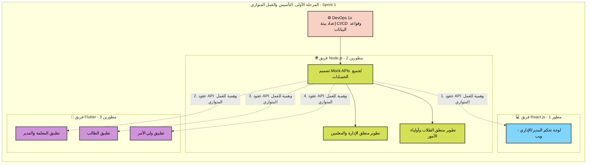
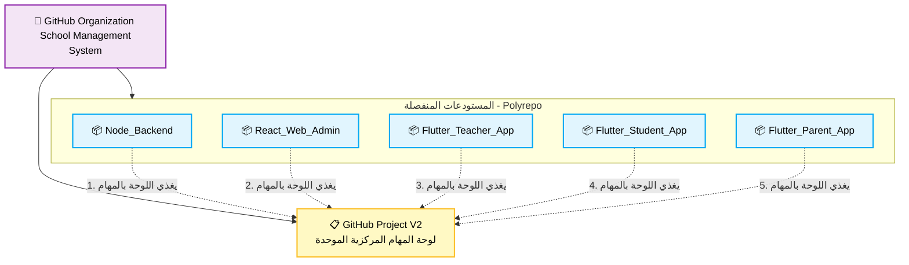
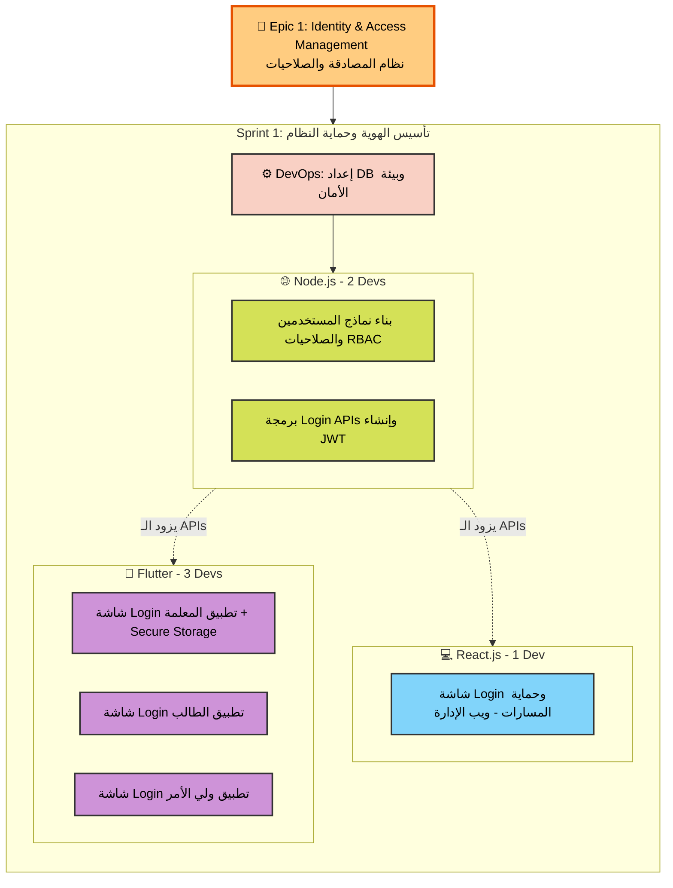
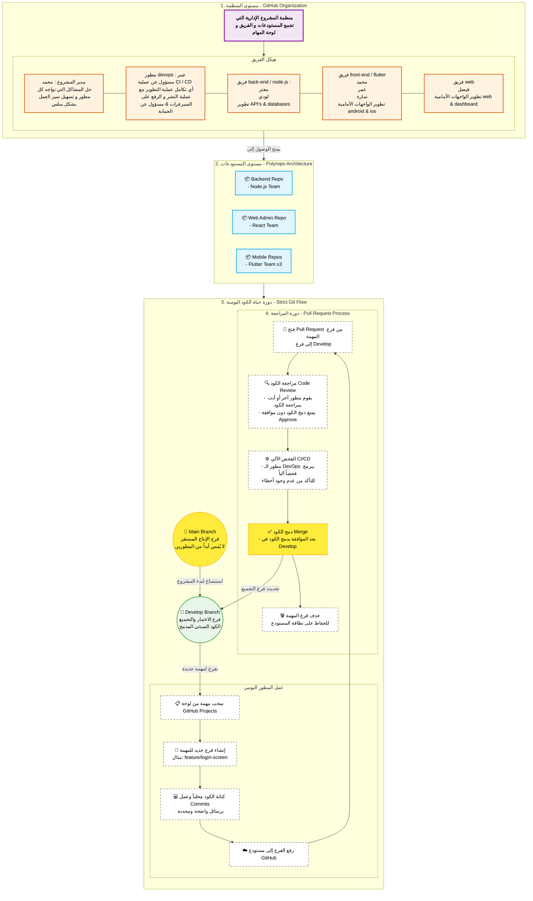

```mermaid

flowchart TD
    classDef devops fill:#f9d0c4,stroke:#333,stroke-width:2px,color:#000;
    classDef backend fill:#d4e157,stroke:#333,stroke-width:2px,color:#000;
    classDef frontend fill:#81d4fa,stroke:#333,stroke-width:2px,color:#000;
    classDef mobile fill:#ce93d8,stroke:#333,stroke-width:2px,color:#000;

    subgraph Phase1 [المرحلة الأولى: التأسيس والعمل المتوازي - Sprint 1]
        direction TB
        
        A[⚙️ DevOps 1x <br> إعداد بيئة CI/CD وقواعد البيانات]:::devops
        
        subgraph Backend_Team [🌐 فريق Node.js - 2 مطورين]
            B1[تصميم Mock APIs لجميع الحسابات]:::backend
            B2[تطوير منطق الإدارة والمعلمين]:::backend
            B3[تطوير منطق الطلاب وأولياء الأمور]:::backend
            B1 --> B2 & B3
        end

        A --> B1

        subgraph Frontend_Web [💻 فريق React.js - 1 مطور]
            C1[لوحة تحكم المدير/الإداري - ويب]:::frontend
        end

        subgraph Mobile_Team [📱 فريق Flutter - 3 مطورين]
            D1[تطبيق المعلمة والمدير]:::mobile
            D2[تطبيق الطالب]:::mobile
            D3[تطبيق ولي الأمر]:::mobile
        end

        B1 -.->|1. عقود API وهمية للعمل المتوازي| C1
        B1 -.->|2. عقود API وهمية للعمل المتوازي| D1
        B1 -.->|3. عقود API وهمية للعمل المتوازي| D2
        B1 -.->|4. عقود API وهمية للعمل المتوازي| D3
    end
```

```mermaid
flowchart TD
    classDef org fill:#f3e5f5,stroke:#8e24aa,stroke-width:2px,color:#000;
    classDef board fill:#fff9c4,stroke:#fbc02d,stroke-width:2px,color:#000;
    classDef repo fill:#e1f5fe,stroke:#03a9f4,stroke-width:2px,color:#000;

    Org[🏢 GitHub Organization <br> School Management System]:::org
    Board[📋 GitHub Project V2 <br> لوحة المهام المركزية الموحدة]:::board

    Org --> Board

    subgraph Repositories [المستودعات المنفصلة - Polyrepo]
        direction LR
        R1[📦 Node_Backend]:::repo
        R2[📦 React_Web_Admin]:::repo
        R3[📦 Flutter_Teacher_App]:::repo
        R4[📦 Flutter_Student_App]:::repo
        R5[📦 Flutter_Parent_App]:::repo
    end

    Org --> Repositories
    
    R1 -.->|1. يغذي اللوحة بالمهام| Board
    R2 -.->|2. يغذي اللوحة بالمهام| Board
    R3 -.->|3. يغذي اللوحة بالمهام| Board
    R4 -.->|4. يغذي اللوحة بالمهام| Board
    R5 -.->|5. يغذي اللوحة بالمهام| Board
```

```mermaid
flowchart TD
    classDef devops fill:#f9d0c4,stroke:#333,stroke-width:2px,color:#000;
    classDef backend fill:#d4e157,stroke:#333,stroke-width:2px,color:#000;
    classDef frontend fill:#81d4fa,stroke:#333,stroke-width:2px,color:#000;
    classDef mobile fill:#ce93d8,stroke:#333,stroke-width:2px,color:#000;
    classDef epic fill:#ffcc80,stroke:#e65100,stroke-width:3px,color:#000;

    Epic1[🔐 Epic 1: Identity & Access Management <br> نظام المصادقة والصلاحيات]:::epic

    subgraph Sprint1 [Sprint 1: تأسيس الهوية وحماية النظام]
        direction TB
        
        A[⚙️ DevOps: إعداد DB وبيئة الأمان]:::devops
        
        subgraph Backend_Team [🌐 Node.js - 2 Devs]
            B1[بناء نماذج المستخدمين والصلاحيات RBAC]:::backend
            B2[برمجة Login APIs وإنشاء JWT]:::backend
        end

        subgraph Frontend_Web [💻 React.js - 1 Dev]
            C1[شاشة Login وحماية المسارات - ويب الإدارة]:::frontend
        end

        subgraph Mobile_Team [📱 Flutter - 3 Devs]
            D1[شاشة Login تطبيق المعلمة + Secure Storage]:::mobile
            D2[شاشة Login تطبيق الطالب]:::mobile
            D3[شاشة Login تطبيق ولي الأمر]:::mobile
        end

        A --> Backend_Team
        Backend_Team -.->|يزود الـ APIs| Frontend_Web
        Backend_Team -.->|يزود الـ APIs| Mobile_Team
    end
    
    Epic1 --> Sprint1
```

```mermaid
flowchart TD
    classDef org fill:#f3e5f5,stroke:#8e24aa,stroke-width:3px,color:#000,font-weight:bold;
    classDef roles fill:#fff3e0,stroke:#e65100,stroke-width:2px,color:#000;
    classDef repos fill:#e1f5fe,stroke:#03a9f4,stroke-width:2px,color:#000;
    classDef gitflow fill:#e8f5e9,stroke:#43a047,stroke-width:2px,color:#000;
    classDef action fill:#fff,stroke:#333,stroke-width:1px,color:#000,stroke-dasharray: 5 5;
    classDef highlight fill:#ffeb3b,stroke:#fbc02d,stroke-width:2px,color:#000;

    subgraph OrgLevel [1. مستوى المنظمة - GitHub Organization]
        direction TB
        Org["منظمة المشروع الإدارية التي تجمع المستودعات و الفريق و لوحة المهام"]:::org
        
        subgraph RolesAccess [هيكل الفريق]
            direction LR
            PM["مدير المشروع : محمد\nحل المشاكل التي تواجه كل مطور و تسهيل سير العمل بشكل سلس"]:::roles
            DevOps["مطور devops : عمر\nمسؤول عن عملية CI / CD أي تكامل عملية التطوير مع عملية النشر و الرفع على السيرفرات & مسؤول عن الحماية"]:::roles
            Backend["فريق back-end / node.js :\nمعتز\nلودي\nتطوير API's & databases"]:::roles
            Flutter["فريق front-end / flutter\nمحمد\nعمر\nسارة\nتطوير الواجهات الأمامية android & ios"]:::roles
            Web["فريق web\nفيصل\nتطوير الواجهات الأمامية web & dashboard"]:::roles
            
            PM --- DevOps --- Backend --- Flutter --- Web
        end
        Org --> RolesAccess
    end

    subgraph ReposLevel [2. مستوى المستودعات - Polyrepo Architecture]
        direction LR
        R1[📦 Backend Repo\n- Node.js Team]:::repos
        R2[📦 Web Admin Repo\n- React Team]:::repos
        R3[📦 Mobile Repos\n- Flutter Team x3]:::repos
    end
    
    RolesAccess -->|يمنح الوصول إلى| ReposLevel

    subgraph GitWorkflow [3. دورة حياة الكود اليومية - Strict Git Flow]
        direction TB
        
        MainBranch((🌳 Main Branch\n فرع الإنتاج المستقر\n لا يُمس أبداً من المطورين)):::highlight
        DevBranch((🌿 Develop Branch\n فرع الاختبار والتجميع\n الكود المبدئي المدمج)):::gitflow
        
        MainBranch -->|استنساخ لبدء المشروع| DevBranch
        
        subgraph DeveloperDaily [عمل المطور اليومي]
            direction TB
            Task[📋 سحب مهمة من لوحة GitHub Projects]:::action
            CreateBranch[🔀 إنشاء فرع جديد للمهمة\n مثال: feature/login-screen]:::action
            Code[💻 كتابة الكود محلياً وعمل Commits\n برسائل واضحة ومحددة]:::action
            Push[☁️ رفع الفرع إلى مستودع GitHub]:::action
            
            Task --> CreateBranch --> Code --> Push
        end
        
        DevBranch -->|تفرع لمهمة جديدة| Task
        
        subgraph PullRequestCycle [4. دورة المراجعة - Pull Request Process]
            direction TB
            OpenPR[📝 فتح Pull Request من فرع المهمة\n إلى فرع Develop]:::action
            Review[🔍 مراجعة الكود Code Review\n- يقوم مطور آخر أو أنت بمراجعة الكود\n- يمنع دمج الكود دون موافقة Approve]:::action
            CI[⚙️ الفحص الآلي CI/CD\n- مطور الـ DevOps يبرمج فحصاً آلياً\n للتأكد من عدم وجود أخطاء]:::action
            Merge[✅ دمج الكود Merge\n- بعد الموافقة يدمج الكود في Develop]:::highlight
            DeleteBranch[🗑️ حذف فرع المهمة\n للحفاظ على نظافة المستودع]:::action
            
            OpenPR --> Review --> CI --> Merge --> DeleteBranch
        end
        
        Push --> OpenPR
        Merge -->|تحديث فرع التجميع| DevBranch
    end
    
    ReposLevel --> GitWorkflow
```
